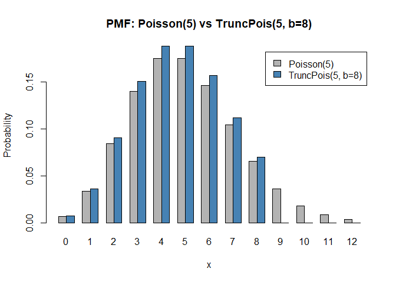

<!-- README.md is generated from README.Rmd. Please edit that file -->

# truncpois

<!-- badges: start -->

<!-- badges: end -->

## Truncated Poisson Distribution Functions

### Written by Arun Sundar Paulraj and Keefe Murphy

## Description

`truncpois` provides a complete suite of distribution functions for the
truncated Poisson distribution, supporting left-truncation,
right-truncation, and doubly-truncated forms. Truncation bounds are
interpreted as `a <= X <= b`. All computations are carried out on the
log scale for numerical stability.

The core functions are `dtruncpois()` (density), `ptruncpois()` (CDF),
`qtruncpois()` (quantiles), and `rtruncpois()` (random generation).
Alongside these, `extruncpois()`, `vartruncpois()`, `medtruncpois()`,
and `modtruncpois()` give the mean, variance, median, and mode.
`mletruncpois()` estimates the rate parameter (with standard error) from
a sample of observed counts via maximum likelihood, and
`plottruncpois()` visualizes the PMF, CDF, or quantile function of a
truncated Poisson distribution against its non-truncated counterpart.

## Installation

You can install the development version of `truncpois` from GitHub:

``` r
# install.packages("pak")
pak::pak("arunsundar022/truncpois")
```

You can then explore the package with:

``` r
library(truncpois)
help(dtruncpois)  # Help on the core density function
```

For a more thorough introduction, a vignette document is available as
follows:

``` r
vignette("truncpois", package = "truncpois")
```

If the vignette is not automatically built when installing from GitHub,
include it explicitly:

``` r
devtools::install_github("arunsundar022/truncpois", build_vignettes = TRUE)
```

## Quick Example

``` r
set.seed(123)
```

Compare the standard Poisson and right-truncated Poisson PMFs:

``` r
x <- 0:12
p_pois <- dpois(x, lambda = 5)
p_trunc <- dtruncpois(x, lambda = 5, a = 0, b = 8)

round(data.frame(x = x, p_pois = p_pois, p_trunc = p_trunc), 4)
#>     x p_pois p_trunc
#> 1   0 0.0067  0.0072
#> 2   1 0.0337  0.0362
#> 3   2 0.0842  0.0904
#> 4   3 0.1404  0.1506
#> 5   4 0.1755  0.1883
#> 6   5 0.1755  0.1883
#> 7   6 0.1462  0.1569
#> 8   7 0.1044  0.1121
#> 9   8 0.0653  0.0700
#> 10  9 0.0363  0.0000
#> 11 10 0.0181  0.0000
#> 12 11 0.0082  0.0000
#> 13 12 0.0034  0.0000
```

``` r
barplot(rbind(Poisson = p_pois, Truncated = p_trunc),
  beside = TRUE, names.arg = x,
  col = c("grey70", "steelblue"),
  ylab = "Probability", xlab = "x",
  main = "PMF: Poisson(5) vs TruncPois(5, b=8)",
  legend.text = c("Poisson(5)", "TruncPois(5, b=8)")
)
```



Generate random draws from a doubly truncated Poisson distribution:

``` r
samples <- rtruncpois(1000, lambda = 4, a = 2, b = 9, method = "bounded")
table(samples)
#> samples
#>   2   3   4   5   6   7   8   9 
#> 171 211 223 171 111  62  36  15
```

Compare empirical and theoretical moments:

``` r
c(
  empirical_mean = mean(samples),
  theoretical_mean = extruncpois(4, a = 2, b = 9)
)
#>   empirical_mean theoretical_mean 
#>          4.24500          4.26672

c(
  empirical_var = var(samples),
  theoretical_var = vartruncpois(4, a = 2, b = 9)
)
#>   empirical_var theoretical_var 
#>        2.961937        2.925129
```

Compute median and mode of truncated distributions:

``` r
medtruncpois(lambda = 4, a = 2, b = 9)
#> [1] 4

# Mode with tied values (lambda = 4 is an integer)
modtruncpois(lambda = 4, a = 2, b = 9)
#> Warning: The mode is not unique: 2 tied values returned.
#> [1] 3 4

# Unique mode (lambda = 2.5 is non-integer)
modtruncpois(lambda = 2.5, a = 0, b = 10)
#> [1] 2
```

## References

Nadarajah, S. and Kotz, S. (2006). R programs for truncated
distributions. *Journal of Statistical Software, Code Snippets*, 16(2),
1–8.
\<[doi:10.18637/jss.v016.c02](https://doi.org/10.18637/jss.v016.c02)\>
